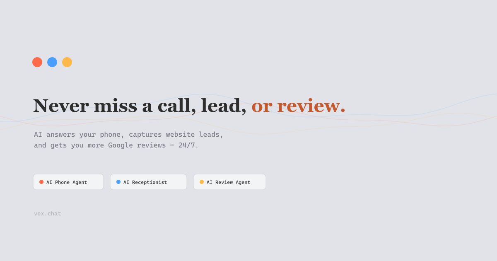
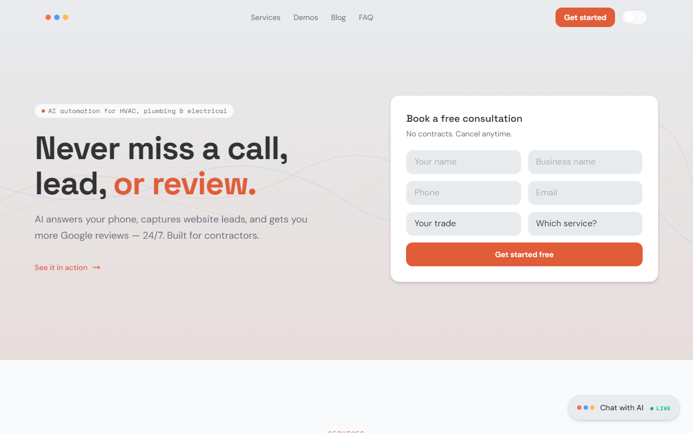

# Vox.chat

**AI phone agents, receptionists, and review automation for contractors** — HVAC, plumbing, electrical, and home services.

**Live:** [vox.chat](https://vox.chat)





## What it does

Missed after-hours calls cost contractors jobs. Vox answers 24/7, qualifies leads, notifies the owner, and can hand off to a live person on a real phone path.

| Capability | Detail |
|------------|--------|
| **Voice AI** | Vapi agent — browser WebRTC on desktop; free PSTN line `(209) 502-3028` on mobile dialer |
| **Live transfer** | Phone path can transfer to a human cell; browser path notifies team + optional callback |
| **Chat receptionist** | On-site lead capture widget |
| **SEO / content** | Local blog + schema for Central Valley service keywords |
| **Legal / FAQ** | Consent, recording, and call-path docs |

## Stack

| Layer | Tech |
|-------|------|
| Frontend | React, TypeScript, Vite, Tailwind |
| Voice | Vapi (`@vapi-ai/web`) + serverless tools |
| Hosting | Vercel |
| CRM / alerts | Google Sheets + SMS hooks |

## Security

Production webhooks **fail closed** without `VAPI_WEBHOOK_SECRET`. See [SECURITY.md](SECURITY.md) for the env checklist (Twilio signatures, Formspree, Upstash rate limits, origin allowlist).

The public product is **not HIPAA compliant** and is not end-to-end encrypted. Processors can read conversation content to deliver leads.

## Quick start

```bash
npm install
cp .env.example .env   # Vapi + lead endpoints as needed
npm run dev
```

```bash
npm run build          # tsc + vite + prerender
```

## Repo layout

- `src/` — marketing site, demos, voice UI (`CallNowButton`, Vapi provider)
- `api/` — serverless tools (e.g. live-person notify)
- `public/` — static assets, OG image, blog art
- `blog.html` / `faq.html` / `legal.html` — multi-page entrypoints

## License

Private commercial product surface; source published for portfolio. All rights reserved.
